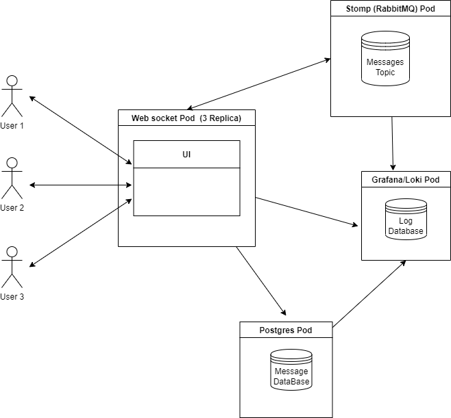

# ChatK8S

## Overview
* [Assignment](./Exercise.md)

## Infrastructure Diagram

[](Infrastructure.png)

## TechStack
* [Docker](https://docs.docker.com/desktop/install/windows-install/)
* [Minikube](https://minikube.sigs.k8s.io/docs/start/)
* [kubectl](https://kubernetes.io/docs/tasks/tools/)
* [helm](https://helm.sh/docs/intro/quickstart/)
* [java jdk 11](https://www.azul.com/downloads/?package=jdk#download-openjdk)
* [maven](https://maven.apache.org/download.cgi)

## Installation

* [Postgres](./message/README.md)
* [RabbitMQ](./RabbitMQSetup/README.md)
* [Logging](./grafana/README.md)
* [Websocket](./websocket-receiver/README.md)

## How to run

```
$ minikube service websocket-receiver-service
```

## Collaborators
* Robin Levine
* Alison Longfellow
* Sremadan Guddati
* Uriel Romero
